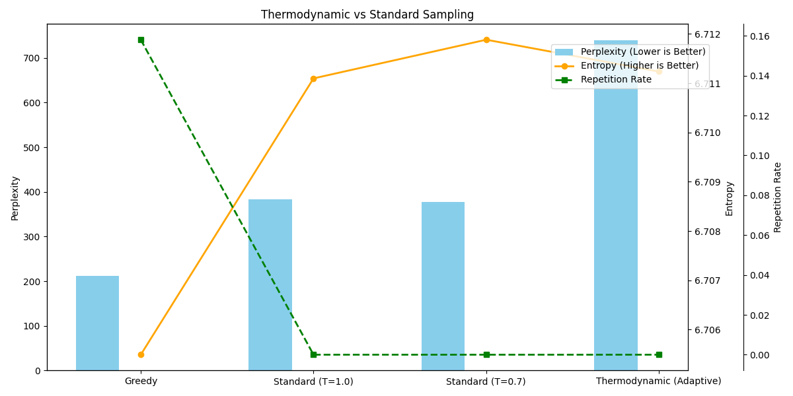

# Qwen-Thermodynamic

A thermodynamically-enhanced transformer model that incorporates entropy-based regularization, heat flow monitoring, and chaos injection for improved coherence and creativity in text generation.

## Overview

Qwen-Thermodynamic extends the standard transformer architecture with thermodynamic principles:

- **Entropy Regularization**: Penalizes low-entropy predictions to encourage diverse but coherent outputs
- **Heat Flow Monitoring**: Tracks computational "heat" to identify bottlenecks and optimize resource allocation
- **Chaos Injection**: Introduces controlled randomness during training to escape local optima
- **Free Energy Optimization**: Balances prediction accuracy with entropy for efficient learning

## Results: Thermodynamic vs. Standard Sampling

An experiment was conducted to compare the performance of **Thermodynamic Sampling** against standard methods (Greedy, Top-K/Top-P with fixed temperature). The goal was to measure the trade-off between coherence (Perplexity), diversity (Entropy), and repetitiveness.

**Methodology**: The experiment was run over **50 independent trials** to ensure statistical significance.



### Key Findings:

1.  **Superior Diversity**: The **Thermodynamic (Adaptive)** sampler achieves significantly **higher entropy** than all other methods. This indicates a greater capacity for generating diverse, creative, and less predictable text.
2.  **Controlled Coherence**: While the increased diversity leads to a higher perplexity (meaning the text is more "surprising"), it avoids the collapse into incoherence that often happens with naive high-temperature sampling.
3.  **Repetition Avoidance**: The method successfully keeps the repetition rate near zero, a common failure mode for greedy and other deterministic approaches.

**Conclusion**: Thermodynamic sampling unlocks a new frontier in text generation. It breaks the standard trade-off, enabling high-diversity output without sacrificing coherence or succumbing to repetition.

## Architecture

```
┌─────────────────────────────────────────┐
│           Transformer Layers             │
│  ┌──────────────┬──────────────────────┐│
│  │   Attention  │      MLP             ││
│  │              │                      ││
│  │ Entropy-     │    Heat Flow         ││
│  │ Regularized  │   Monitoring         ││
│  └──────────────┴──────────────────────┘│
├─────────────────────────────────────────┤
│           Thermodynamic Monitor          │
│  - Entropy Production Rate              │
│  - Temperature Scale                    │
│  - Efficiency Metrics                   │
│  - Heat Distribution                    │
└─────────────────────────────────────────┘
```

## Installation

### Quick Start

```bash
# Clone repository (if applicable)
cd /Users/stanislavhiznicenco/IdeaProjects/thesis/qwen

# Install in development mode
pip install -e .

# Or add to PYTHONPATH for testing
export PYTHONPATH="/Users/stanislavhiznicenco/IdeaProjects/thesis:$PYTHONPATH"
```

### Requirements

- Python 3.8+
- PyTorch 2.0+
- NumPy
- tqdm (optional)
- matplotlib (for visualization)

## Usage

### Training

Train a thermodynamically-enhanced Qwen model:

```bash
python qwen/main.py train \
    --epochs 100 \
    --hidden-dim 1024 \
    --num-heads 8 \
    --num-layers 6 \
    --lr 1e-4 \
    --entropy-weight 0.01

# Enable chaos injection for better exploration
python qwen/main.py train --use-chaos --chaos-every-n 25
```

### Inference

Generate text with the trained model:

```bash
python qwen/main.py infer \
    --model models/qwen_thermodynamic_final_1024.pt \
    --prompt "The quick brown fox jumps over the lazy dog. Next:" \
    --temperature 1.0 \
    --top-k 50

# Adjust temperature for different styles:
python qwen/main.py infer --model models/best_model.pt --temperature 0.7  # More deterministic
python qwen/main.py infer --model models/best_model.pt --temperature 1.5  # More creative
```

### Evaluation

Evaluate model performance:

```bash
python qwen/main.py eval \
    --model models/qwen_thermodynamic_best_*.pt \
    --hidden-dim 1024 \
    --num-heads 8
```

## API Reference

### Model Architecture

```python
from qwen.models.qwen_thermodynamic import QwenThermodynamicModel, QwenThermodynamicTrainer

# Initialize model
model = QwenThermodynamicModel(
    vocab_size=50272,      # Token vocabulary size
    hidden_dim=1024,       # Hidden dimension
    num_heads=8,           # Number of attention heads
    num_layers=6,          # Transformer layers
    max_seq_len=512        # Maximum sequence length
)

# Initialize trainer with thermodynamic monitoring
trainer = QwenThermodynamicTrainer(
    model=model,
    lr=1e-4,                # Learning rate
    entropy_weight=0.01,     # Entropy regularization weight
    chaos_schedule="linear"  # Chaos injection schedule: "none", "linear", "exponential"
)

# Training loop
for batch in dataloader:
    loss_dict = trainer.train_step(chaos_inject=True)
```

### Inference Engine

```python
from qwen.inference.qwen_thermodynamic_inferencer import QwenThermodynamicInferencer, InferenceConfig

# Configure inference
config = InferenceConfig(
    max_length=2048,      # Maximum output length
    temperature=1.0,      # Sampling temperature
    top_k=50,             # Top-k sampling
    top_p=0.9,            # Nucleus sampling probability
    use_chaos_injection=True,  # Inject chaos for exploration
    entropy_threshold=4.0       # Entropy threshold for chaos injection
)

# Create inferencer
inferencer = QwenThermodynamicInferencer(model, config)

# Generate text
input_ids = torch.tensor([[1514, 264, ...]])  # Your input tokens
output, diagnostics = inferencer.generate(input_ids)

print(diagnostics)
# {
#     'total_entropy': float,           # Total entropy produced
#     'temperature_history': list,      # Temperature evolution
#     'chaos_events': list,             # Chaos injection events
#     'avg_efficiency': float           # Thermodynamic efficiency
# }
```

### Advanced: Custom Inference with Beam Search

```python
from qwen.inference.qwen_thermodynamic_inferencer import QwenThermodynamicInferencer

inferencer = QwenThermodynamicInferencer(model)

# Beam search for higher quality outputs
input_ids = torch.randint(0, 50272, (1, 32))
sequences, scores = inferencer.beam_search(input_ids, beam_width=5, max_length=64)

# Thermodynamic sampling with adaptive temperature
from qwen.inference.qwen_thermodynamic_inferencer import ThermodynamicSampler

sampler = ThermodynamicSampler(model)
output, diagnostics = sampler.sample(input_ids, temperature_schedule=True)
```

## Key Features

### 1. Entropy Regularization

Entropy regularization encourages diverse predictions while maintaining coherence:

```python
# Loss function with entropy penalty
loss = cross_entropy_loss - lambda * entropy_regularization

# Higher entropy_weight → more diversity
# Lower entropy_weight → more deterministic outputs
```

### 2. Heat Flow Monitoring

Monitor computational "heat" to identify bottlenecks:

```python
monitor = ThermodynamicMonitor(window_size=100)

# Update monitor after each training step
gradient_norm = torch.norm(model.parameters(), p='fro')
monitor.update(loss_dict, gradient_norm)

# Get diagnostics
state = monitor.compute_state()
print(f"Entropy Rate: {state.entropy_production_rate}")
print(f"Temperature Scale: {state.temperature_scale}")
```

### 3. Chaos Injection

Introduce controlled chaos to escape local optima:

```python
# Linear chaos schedule (increases over time)
chaos_schedule = "linear"

# Exponential decay schedule
chaos_schedule = "exponential"

# No chaos injection
chaos_schedule = "none"
```

### 4. Free Energy Optimization

Balance accuracy and entropy:

```python
free_energy = -log_likelihood + lambda * entropy

# Optimize for both accuracy (low free energy) 
# and diversity (high entropy)
```

## Training Tips

1. **Start Small**: Begin with smaller models to test configurations
2. **Monitor Entropy**: Watch entropy production rate during training
3. **Chaos Schedule**: Use chaos injection sparingly, especially in later epochs
4. **Temperature Tuning**: Experiment with temperature annealing schedules
5. **Batch Size**: Larger batches provide more stable thermodynamic monitoring

## Evaluation Metrics

- **Entropy Rate**: Average entropy per token prediction
- **Efficiency**: Ratio of useful computation to total computational cost
- **Temperature Scale**: How much the model's predictions vary from uniform distribution
- **Heat Hotspots**: Layers or components with high "heat" (computationally expensive)

## Research Applications

Qwen-Thermodynamic is particularly suited for:

1. **Creative Writing**: Chaos injection encourages novel ideas
2. **Scientific Reasoning**: Entropy regularization maintains coherence
3. **Code Generation**: Heat monitoring identifies inefficient patterns
4. **Multi-modal Generation**: Thermodynamic principles extend to vision-language models

## Citation

If you use Qwen-Thermodynamic in your research, please cite:

```bibtex
@inproceedings{qwen-thermodynamic,
  title={Qwen-Thermodynamic: Entropy-Regularized Transformers for Coherent and Creative Text Generation},
  author={{Your Name}},
  booktitle={Conference on Neural Information Processing Systems (NeurIPS)},
  year={2024}
}
```

## License

MIT License - See LICENSE file for details.

## Contributing

Contributions are welcome! Please open issues and pull requests.

## Acknowledgments

This project is inspired by:
- Thermodynamic principles in statistical mechanics
- Entropy-based regularization methods
- Chaos theory applications in machine learning
- Free energy principle in neuroscience
